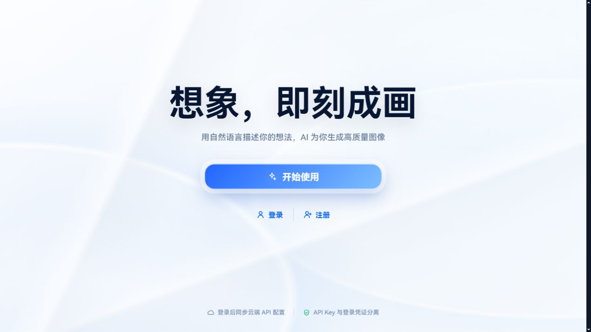

<div align="center">
  
  <h1>GPT Image 2 for TJH</h1>
  <p>面向 OpenAI Images / Responses API 及兼容服务的 AI 图像生成、编辑与多轮 Agent 工作台</p>

  <p>
    <a href="RELEASE.md"></a>
    <a href="https://react.dev/"></a>
    <a href="https://www.typescriptlang.org/"></a>
    <a href="https://vite.dev/"></a>
    <a href="https://github.com/tjh1342839380-afk/main/stargazers"></a>
    <a href="https://github.com/tjh1342839380-afk/main/forks"></a>
  </p>
</div>

> [!IMPORTANT]
> API Key 请只在应用内填写，不要提交到仓库。所有 `VITE_*` 变量都会进入浏览器构建产物，不能用于保存密钥。浏览器直接访问 HTTP 或未开放 CORS 的接口时，需使用可信的同源代理。

## 界面预览



## 核心能力

### 图像生成与编辑

- 支持 OpenAI Images API、Responses API、fal.ai，以及可导入 JSON 配置的自定义 HTTP 服务商
- 支持文生图、最多 16 张参考图、遮罩编辑、批量生成和流式中间图预览
- 内置遮罩画笔、橡皮擦、撤销重做和缩放操作，可在本地处理 PNG 透明背景
- 支持多套 API 配置、排序、复制，以及通过 URL 或 JSON 快速导入

### Agent 多轮工作台

- 支持多轮上下文、图片引用、消息分支、重新生成和关联图片批量生成
- 可选网络搜索与图片工具，并支持 PDF、Office、文本和表格等参考文件
- 支持在浏览器中生成可继续编辑的 PPTX 文件

### 画廊与本地数据

- 历史任务、参数和图片记录保存在浏览器本地，支持搜索、筛选、收藏和多选管理
- 支持结果转参考图、ZIP 批量下载以及数据导入导出
- 提供桌面端和移动端响应式布局、浅色/深色主题及 PWA 安装

### 账户与控制台

- 可选接入 Sub2API 登录、注册和用户会话
- 登录后可自动复用或创建图片 API Key
- 站内控制台包含账户概览、用量仪表盘、个人资料、密码修改和应用设置

## 快速开始

建议使用 Node.js 20 或更高版本，并使用仓库内的 `package-lock.json` 安装依赖。

```bash
git clone https://github.com/tjh1342839380-afk/main.git
cd main
npm ci
npm run dev
```

开发服务器默认运行在 [http://localhost:5173](http://localhost:5173)。进入应用后，可在设置中添加 OpenAI、fal.ai 或其他兼容服务的 API 地址、模型与 API Key。

常用开发命令：

| 命令 | 用途 |
| --- | --- |
| `npm run dev` | 启动 Vite 开发服务器 |
| `npm run build` | TypeScript 检查并生成生产构建 |
| `npm run preview` | 本地预览生产构建 |
| `npm test` | 运行 Vitest 测试 |
| `npm run test:watch` | 监听文件并运行测试 |

## 前端环境变量

本地开发时可在 `.env.local` 中配置以下变量。API Key 不应写入任何前端环境变量。

| 变量 | 作用 |
| --- | --- |
| `VITE_DEFAULT_API_URL` | 默认的 OpenAI 兼容 API Base URL |
| `VITE_SUB2API_AUTH_URL` | Sub2API 用户接口地址，通常以 `/api/v1` 结尾 |
| `VITE_SUB2API_AUTH_PROXY` | 设为 `true` 时，通过同源 `/sub2api-auth/*` 访问用户接口 |
| `VITE_SUB2API_AUTO_CONFIGURE` | 设为 `true` 时，登录后自动复用或创建图片 API Key |
| `VITE_API_PROXY_AVAILABLE` | 标记当前部署是否提供同源图片 API 代理 |
| `VITE_API_PROXY_LOCKED` | 设为 `true` 时，锁定已配置的同源代理模式 |
| `VITE_API_PROXY_DYNAMIC_TARGET` | 允许代理读取受支持的动态 HTTPS 目标，仅用于受信任部署 |
| `VITE_SHOW_DEFAULT_CONFIG_ONLY` | 设为 `true` 时，仅显示默认 API 配置 |

Sub2API 的基础配置示例：

```env
VITE_DEFAULT_API_URL=https://sub2api.example.com/v1
VITE_SUB2API_AUTH_URL=https://sub2api.example.com/api/v1
VITE_SUB2API_AUTH_PROXY=true
VITE_SUB2API_AUTO_CONFIGURE=true
```

## Sub2API 可选接入

Sub2API 的用户接口和模型网关是两个独立入口：

- 用户认证、资料、用量与用户 API Key：`/api/v1`
- OpenAI 兼容图片模型网关：`/v1`

本项目提供自己的站内用户控制台前端，账户、用量和 API Key 数据仍来自配置的 Sub2API 服务。若需要完全自有的后台，需要自行部署 Sub2API、PostgreSQL 和 Redis，再将前端及服务端变量切换到自己的域名。详细配置见 [Sub2API 接入文档](docs/sub2api-auth.md)。

## 部署

### Cloudflare Workers

项目使用 Cloudflare Workers + Static Assets，同时提供静态页面、图片 API 代理和 Sub2API 用户接口代理。

```bash
npm ci
npm run deploy:cf
```

部署前请按需配置 Worker 服务端变量：

| 变量 | 作用 |
| --- | --- |
| `API_PROXY_URL` | 固定的图片 API 上游地址 |
| `SUB2API_AUTH_URL` | Sub2API 用户接口上游地址 |

### Docker / Nginx

```bash
docker build -f deploy/Dockerfile -t gpt-image-2-for-tjh .

docker run --rm -p 8080:80 \
  -e DEFAULT_API_URL=https://api.example.com/v1 \
  -e API_PROXY_URL=https://api.example.com/v1 \
  -e SUB2API_AUTH_URL=https://sub2api.example.com/api/v1 \
  -e ENABLE_API_PROXY=true \
  gpt-image-2-for-tjh
```

容器启动后访问 [http://localhost:8080](http://localhost:8080)。其他可选运行时变量包括 `LOCK_API_PROXY` 和 `SHOW_DEFAULT_CONFIG_ONLY`。

> [!NOTE]
> GitHub Pages 只能托管静态前端，无法直接提供本项目的同源 API 与认证代理。公开部署代理前，请限制允许的目标和路径；不要把允许任意动态目标的代理当作密钥保护或访问控制边界。

## 数据与安全

- 生成记录、配置和收藏主要保存在当前浏览器的 IndexedDB 等本地存储中，清理站点数据前请先导出备份
- API Key、JWT、SMTP 密码和其他凭据不要写入 README、前端环境变量或提交记录
- 使用第三方模型与 Sub2API 服务时，数据处理规则取决于对应服务商，请在部署前核对其隐私政策
- 生产环境应使用 HTTPS，并为代理设置固定上游、请求方法限制、超时和访问控制

## 更多文档

- [Sub2API 用户认证与控制台接入](docs/sub2api-auth.md)
- [自定义服务商配置提示词](docs/custom-provider-llm-prompt.md)
- [本地图像故障模拟 API](docs/mock-image-api.md)
- [版本记录](RELEASE.md)

## 上游与许可

本项目基于 [CookSleep/gpt_image_playground](https://github.com/CookSleep/gpt_image_playground) 继续开发。当前仓库尚未包含独立的 `LICENSE` 文件；使用、分发或再发布前，请同时核对上游项目的许可条款及本仓库后续发布的许可说明。
